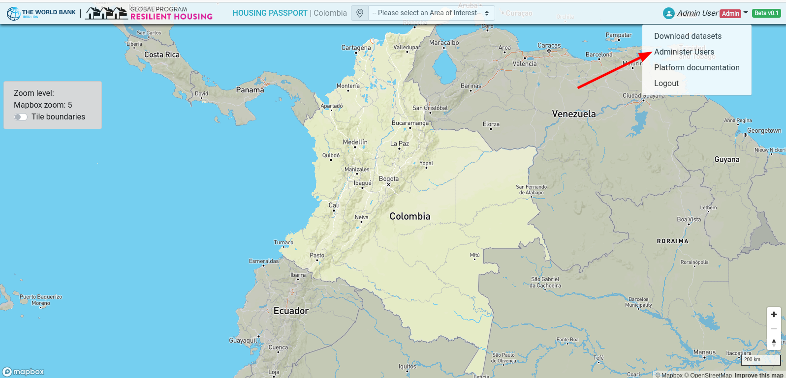
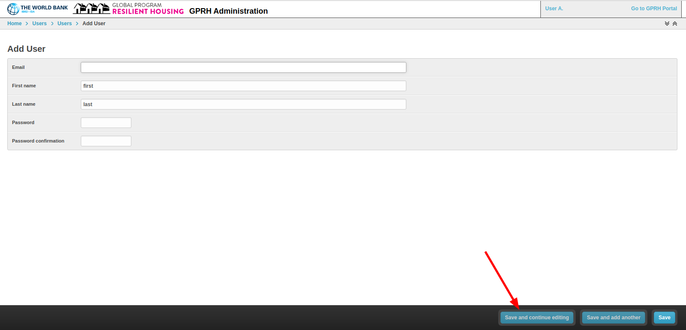
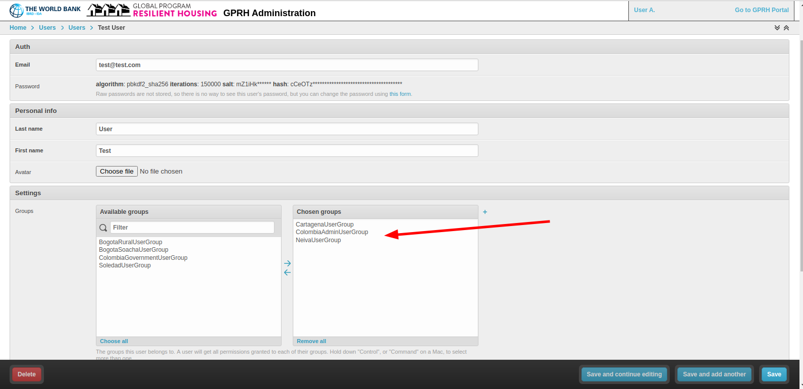
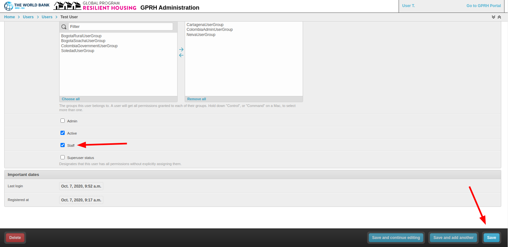

# Django Admin

The django admin interface is available both in local development and production / staging environments. The admin interface is available at `http://localhost:8000/admin/`. If the logged in user is a member of the `AdminUserGroup`, they can access the admin interface using a link in the user dropdown menu in the portal user interface.

In the admin interface its possible to add users by clicking on the `Users` link then clicking the `Add User` button. Add a _username_, _first name_, _last name_ and _password_ for the new user. Then click the `Save and continue editing` button.

In the next screen, the new user can be assigned to one or more groups. If adding a 'city level' user, simply assign the user to the city they will have permission to view. Continue adding groups until you have configured the new users permissions.

If this new user should be able to login to the admin interface and administer users, check the `Staff` checkbox. Click `Save` to create the new user.

