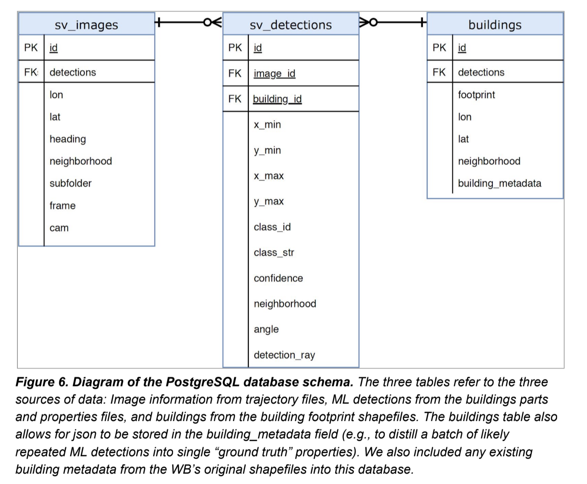

# Import Workflow

This is a general description of the portal import workflow.

Prepartion of data for import to the portal is a complex ETL process as it involves amalgamating data from various sources, including building footprint shapefiles, drone and streetview predictions and in some cases third-party survey data. This data is usually provided in mixed formats, for example, street-view predictions are provided as a postgis dump while drone predictions are generally provided as shapefiles.

In addtion, amendments are made to building footprint files to add values such as building heights, slope and volumes etc. Validation and correction of building footprints is also carried out. In order to have a coherent approach to the preparation of data for import, **all** data for a particular instance, regardless of its source, is stored in a PostGIS instance. Since, typically, each Area of Interest requires bespoke preparation, a set of unique **sql** scripts have been created which produce a consistent set of import tables for each area of interest. These tables are stored in a separate PostGIS `schema` named after the area of interest. Once this set of tables has been produced the schema is exported to a geopackage. The geopackage is then imported to the portal.

These bespoke _sql_ scripts and the docker configuration for the PostGIS instance are hosted in a separate github repository at [https://github.com/bjohare/wb-gprh-db](https://github.com/bjohare/wb-gprh-db). Instuctions on how to create an instance of `wb-gprh-db` are beyond the scope of this documentation. Please get in touch for more information.

## DevelopmentSeed PostGIS Schema

Streetview predictions are provided as a PostGIS dump by DevSEED. This dump contains three tables representing `buildings`, `images` and `streetview detections` respectively (See schema diagram below).



The _sql_ scripts for each Area of Interest derive tables from this postgis dump and join the footprints files to building images and confidence values. Please consult the _sql_ scripts at [https://github.com/bjohare/wb-gprh-db](https://github.com/bjohare/wb-gprh-db) for an example of how this is done.

## Importing data

Once the tables have been generated for a particular Area of Interest they can be exported to a geopackage using the `export-schema` utility in the `wb-gprh-db` repo.

In order to import a geopackage to the portal the geopackage file should be placed in the `../imports` bind mounted directory, in a sub-directory named for the portal instance country, eg `../imports/colombia/el-pozon.gpkg`. As an example, to import data for the `El Pozon` area of interest, run the following command from the root of the source tree:

```bash
./loaddata import pozon
```

To delete pozon data run:

```bash
./loaddata delete pozon
```

This script works by reading an import configuration from `backend/apps/geodata/imports/gpkg/pozon.json`. This configuration defines the layers to be imported as follows...

```
    {
      "name": "El Pozon",
      "layers": [
        {
          "name": "aoi",
          "db_layers": ["aoi"],
          "model": "aoi",
          "mapping": "aoi"
        },
        {
          "name": "sectors",
          "db_layers": ["sectors"],
          "model": "sector",
          "mapping": "sectors"
        },
        ...
    }
```

Each layer definition contains the name of the layer, which layer in the geopackage to load, the backend model to populate and the mapping file to use to map the geopackage layer attributes to the model fields. This mapping file can be found at `backend/apps/geodata/imports/mappings.py`. The mapping file contains python dicts as follows:

```python
aoi = {
    'country': 'country',
    'city': 'city',
    'name': 'name',
    'sv_key': 'sv_key',
    'sv_lat': 'lat',
    'sv_lng': 'lng',
    'geom': 'MULTIPOLYGON',
}
```

The key-value pairs in the pyton dict map the model fields (keys) to the attributes of the geopackage layers (values).
