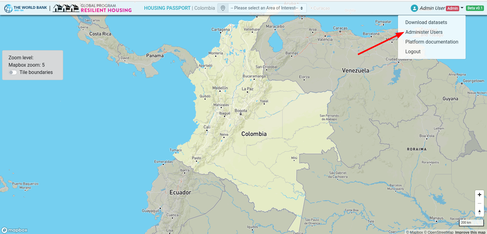
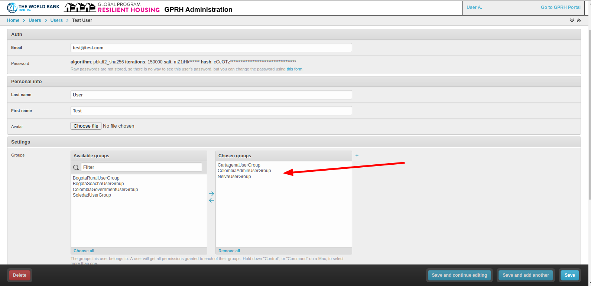
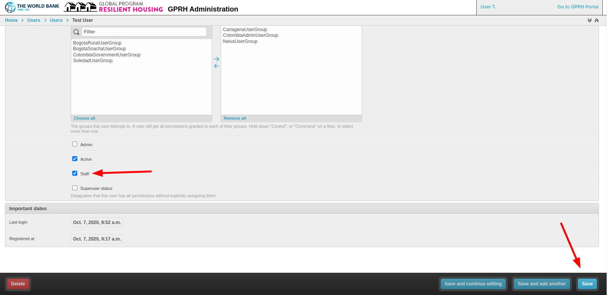

# User Administration

If the current user is an administrator a link titled **Administer Users** will appear in the User menu.

In the admin interface its possible to add users by clicking on the `Users` link then clicking the `Add User` button. Add a _username_, _first name_, _last name_ and _password_ for the new user. Then click the `Save and continue editing` button.

In the next screen, the new user can be assigned to one or more groups. If adding a 'city level' user, simply assign the user to the city they will have permission to view. Continue adding groups until you have configured the new users permissions.

If this new user should be able to login to the admin interface and administer users, check the `Staff` checkbox. Click `Save` to create the new user.

