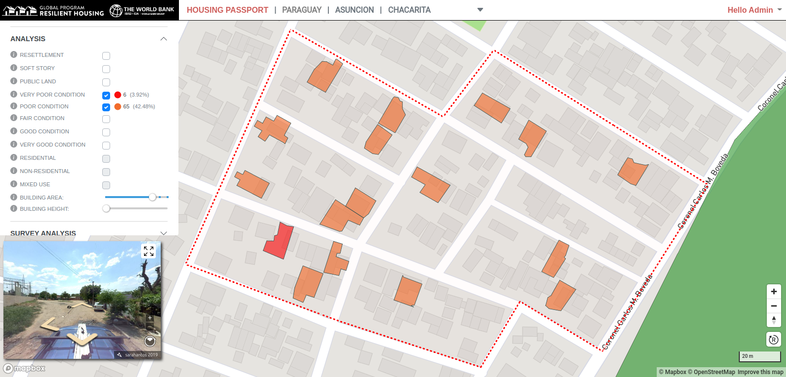

# Analysis

Each passport within the Housing Portal contains its own _Analysis_ section. In the case of **AOI**, **Sector** and **Custom** passports, this consists of a set of filters that can be applied to the currently selected feature, whether that's the entire AOI, the currently selected Sector or the current custom analysis area. The example below uses the Custom Analysis tools.

In the above image, a custom area has been defined to include a number of city blocks. A range of filters have been applied that hightlight features according to their condition.

A more detailed view of the Custom Analysis panel showing condition selections. The number and percentage of buildings with the selected condition in the selected area is shown. The same principle applies to both the **AOI** and **Sector** passport analysis panels.

The following image shows buildings that are in _very poor_ or _poor_ condition and whose area is greater than _100sqm_.

