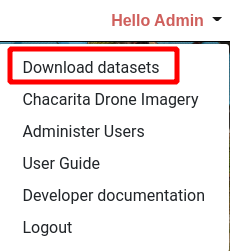
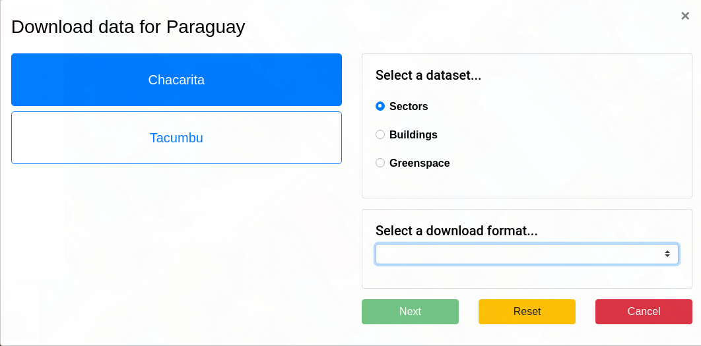
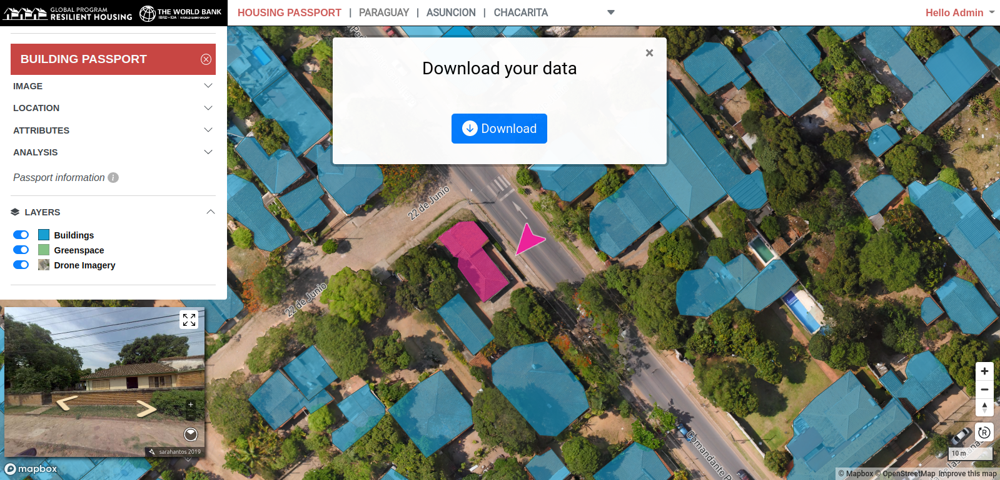

# Downloading Data

Housing Portal data is available for download using the **Download Selector Tool**. To launch the tool click the **Download dataset** link in the user menu.

When the **Download Selector Tool** becomes active, select the Area of Interest you wish to download data for. Then select a dataset to download, and finally select a download format. Click next.

A dialog will appear with a button you can click to download your selected dataset.

## Available datasets

Three types of data can currently be downloaded from the Housing Portal; **Sectors**, **Buildings** and **Greenspace**. Data can be downloaded in four formats; **GeoJson**, **GeoPackage**, **Esri Shapefile** and **CSV**. All datasets are delivered as zipped packages.
