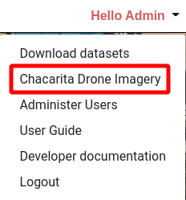
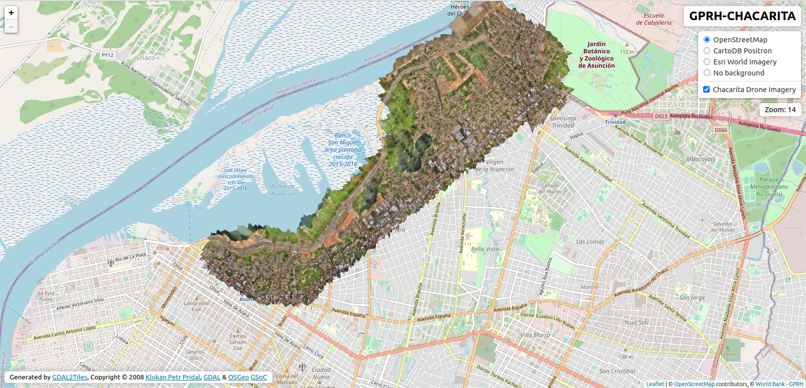

# Drone Imagery Viewer

A simple drone imagery viewer interface is provided as part of the Housing Portal. This is a simple map interface which shows the full extent of the drone imagery available for the currently selected Area of Interest.

Access the drone imagery viewer by clicking on the _Drone Imagery_ link in the user menu.

A new tab will open in your browser with the **Drone Imagery Viewer** map. A range of background layers are available to provide additional context.

