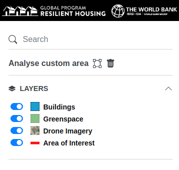

# Layers

The layers available in the housing passport are as follows:

- **Street View Coverage** - this layer is dynamically imported from the [Mapillary Street View](https://www.mapillary.com/) service and shows the available street view coverage.
- **Buildings** - the building footprints for the currently selected Area of Interest (AOI).
- **Greenspace** - the greenspace areas in the current AOI.
- **Sectors** - neighborhoods in the current AOI.
- **Area of Interest** - the extent of the current AOI.
- **Drone Imagery** - the drone imagery for the current AOI.

The Housing Portal side bar contains a **Layer Switcher** which enables the toggling of layer visibility.

The layers appearance in the **Layer Switcher** is dependent on the map zoom level. Not all layers are available at every zoom level. This is configurable on a per AOI basis and is determined by the extent of the AOI itself. In general, **Drone Imagery** and **Street View Coverage** is only available at higher zoom levels, to provide context when working with individual buildings. Correspondingly, the AOI and Sector layers are available at lower zoom levels. **Buildings** and Greenspace are available at all zoom levels.
