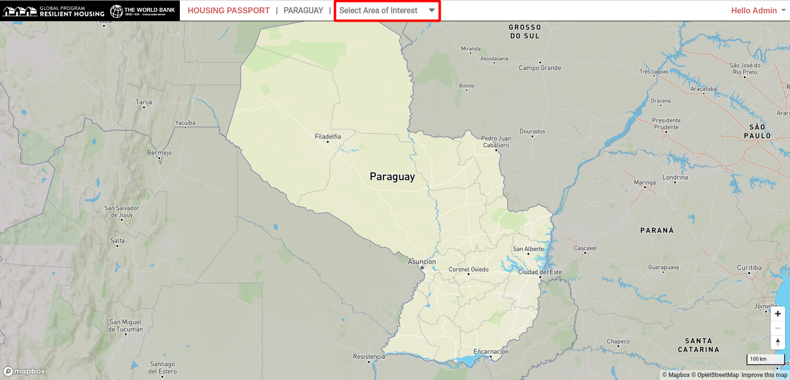
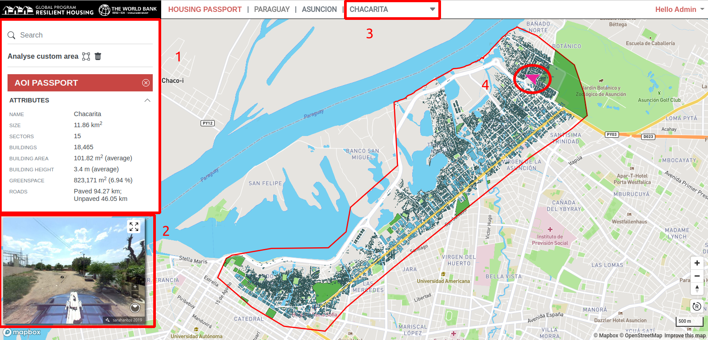
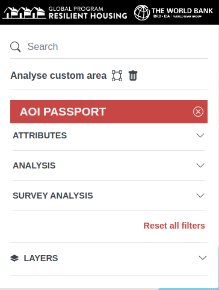
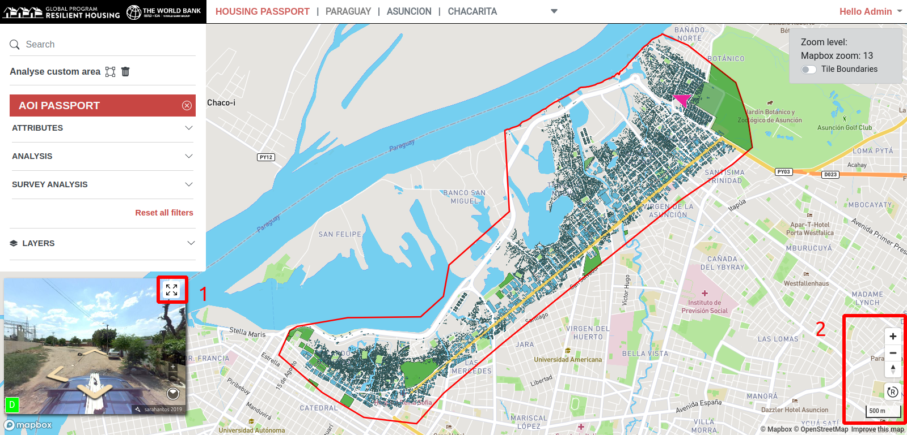
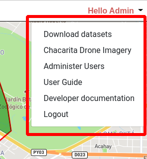

# Map Viewer

The **map viewer** is the main page of the housing portal application and contains all the controls for visualising and querying housing portal data. This page provides an overview of the various map viewer components.

## Select an Area of Interest

To begin working with the data you need to select an **Area of Interest (AOI)** to work with. Start by selecting an AOI in the AOI selection dropdown, indicated below in red. Only AOI's to which you have been granted access will be available in the select AOI dropdown list.

Once you have selected an AOI, the map will zoom to this location and the [**Sidebar**](#sidebar) will become active on the left hand side of the screen (**1**). The **Mapillary street viewer** will also be activated (**2**). The selected AOI is dispayed in the map viewer top navigaton bar (**3**). To select a different AOI to work with, use the AOI selection dropdown to select an alternative AOI. The location and orientation of the Mapillary viewer is indicated by a pink arrow on the map, circled below in red (**4**).

## Sidebar

The application sidebar provides the main tools for working with the currently seleted dataset.

- **Search** - Search for a building by building address. Clicking on a result entry zooms to that location on the map. For more about searching see [here](searching.md).
- **Analyse custom area** - This tool provides a way to define a custom area on the map for analysis. A subset of buildings are selected that fall within the user defined area. For more about defining a custom area for analysis see [here](passports.html#custom-area-passport).
- **AOI Passport** - This component provides headline statistics for the currently selected feature. It also provides analysis tools for querying the available data. See [here](passports.md).
- **Layers** - Enables toggling the visiblity of currently available layers. Layers become available depending on the current map zoom level. See [here](layers.md) for more information about the **Layer Switcher**.

## Other Map Controls

The following image shows the other important map controls.

1. Toggle between Map viewer and Street viewer.
2. Zoom controls, Scale control and Map Reset button .

## User Menu

The user menu contains links to application functions. The list varies according to the current users permissions. In the image below, the user has administrative priveliges and therefore has more functions available to them.

- **Download datasets** - Activate the download datasets tool.
- **Drone Imagery** - Links to a drone imagery viewer for the selected Area of Interest. (link)
- **Administer Users** - Administrator access to a user managment interface. (link)
- **Developer Documentaion** - Links to techical software development documentation for the portal.
- **Logout** - Logout of the portal.
