# Housing Passports

This page provides information about the various **passports** available in the housing portal. A **passport** is a panel that becomes active in the [sidebar](#mapviewer.md#sidebar) when a feature on the map is selected or a custom area is drawn on the map. The passport can be dismissed by clicking on the **'x'** in the passport header.

There are **four** different passports available in the housing portal:

- **Area of Interest passport** - active when the entire AOI is selected.
- **Sector passport** - active when a sector / neighbourhood is selected.
- **Custom Area passport** - active when a custom area has been drawn on the map.
- **Building passport** - active when a single building has been selected.

## Area of Interest Passport

The **AOI passport** is the main AOI information and analysis panel. It become active when an AOI is selected from the AOI dropdown control, when the AOI polygon is clicked on the map, or when the Map reset button is clicked. The **AOI Passport** contains a minimum of two sections, _Attributes_ and _Analysis_, additional sections may be displayed depending on the availablity of underlying data.

### AOI Attributes

The AOI Attributes section shows headline statistics for the currently selected AOI. This panel includes information about the name of the Area of Interest, the area in square kilometers, number of sectors and buildings etc.

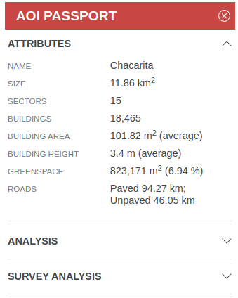

### AOI Analysis

The **Analysis** section of the passport allows for basic filtering / analysis of the AOI data. Buildings can be filtered by a range of their underlying attributes derived from the drone and street view imagery using Machine Learning. See [here](analysis.md) for more detailed information about the portals analysis functionality.

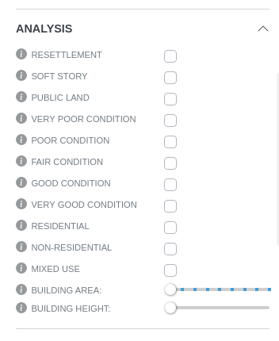

The range of analysis functions can differ between AOI's depending on the availablilty of the underlying attributes.

## Sector Passport

The **Sector passport** is active whenever a sector is selected. A sector can be considered equal to a city neighborhood. The Sector's _attributes_ and _analysis_ panels are generally identical to the **AOI Analysis** panel for the current Area of Interest. To dismiss the current sector selection click the **'x'** in the Sector Passport header.

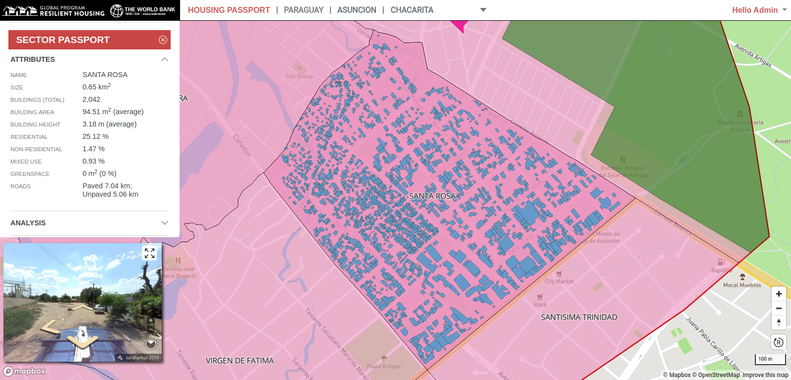

## Custom Area Passport

The **Custom Area Passport** is active whenever a custom area has been defined on the map. The statistics displayed in the Custom Area Passports' _attributes_ panel are defined by the extent of the custom area. Any filters applied in the _analysis_ panel apply only to the currently selected buildings.

To begin drawing a custom area for analysis click on the polygon tool 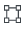 in the **Analyse custom area** panel of the sidebar. Define the custom area by clicking a sequence of points on the map. Double-click the last point to complete the drawing.

To dismiss the **Custom Area Passport** and the current area selection, click on the **'x'** in the custom area passport header or on the _trash_ icon  in the **Analyse custom area** panel.

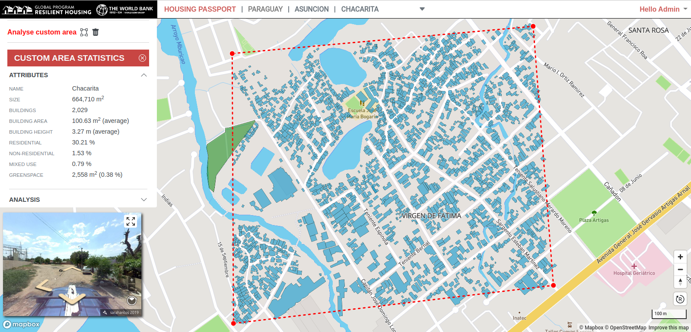

The map can be reset to the default **AOI Passport** selection at any time by clicking on the **Map Reset** button  located at the bottom right of the map view.

## Building Passport

The **Building Passport** displays detailed information about the currently selected building. To select a building, zoom in to an area of the map until buildings become visible. Click on a building to select it. The selected building will appear pink in the map view. The **Building Passport** will become active.

The mapillary viewer will automatically navigate to the selected building and orient the view such that the viewer is centered on the building's street-facing facade. Please note, that this only happens when there is fully panoramic imagery available for the selected building. Otherwise the mapillary viewer will be oriented in the direction of the available Mapillary imagery. An image of the building will be displayed prominently in the **Building Passport** if an image is available for the selected building. Because of the zoom level, drone imagery for the AOI will appear on the map. To select an alternative building, click on its footprint.

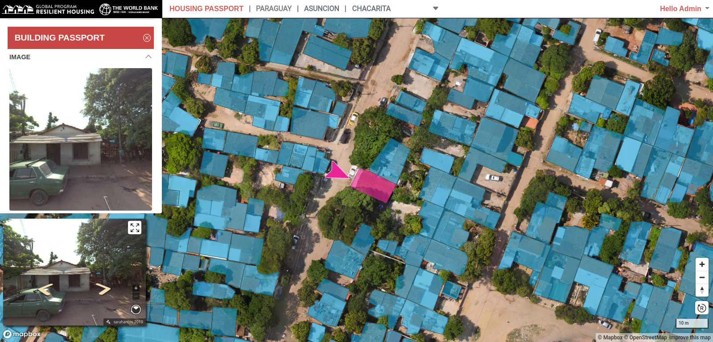

### Building Passport Sections

The Building Passport has **four** expandable sections as follows:

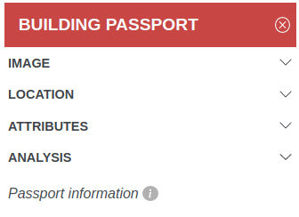

The **Image** section contains an image of the building if one is available. Otherwise the message _No images found_ will be displayed.

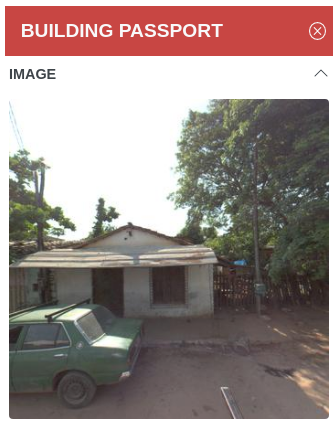

The **Location** section of the Building Passport contains basic location information about the selected building, eg its City, Sector, Address (if available) and its coordinates in Latitude and Longitude.

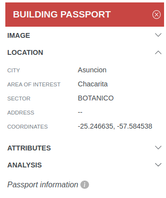

The **Attributes** section of the Building Passport contains details of the selected buildings properties derived from drone imagery and street view predictions. Where available, the confidence with with which an attribute has been detected is indicated by a 'traffic-light' system. Green represents _high confidence_, yellow represents _medium confidence_ and red represents _low confidence_.

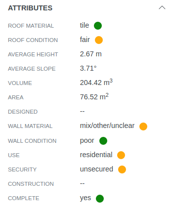

The **Analysis** section of the Building Passport represent values derived from the buildings' other attributes. For details of how these values are calculated see the [Building Passport Information](#building-passport-information) section below.

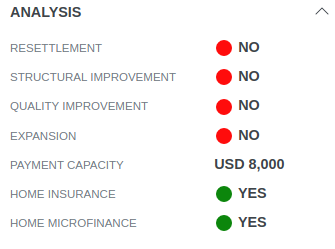

### Building Passport Information

Further details about the contents of the Building Passport are available by clicking on the _Passport Information_ link (outlined in red) at the bottom of the Building Passport.

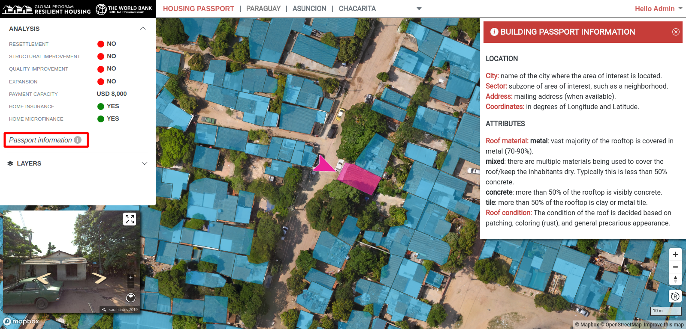
