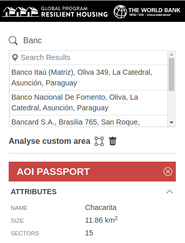
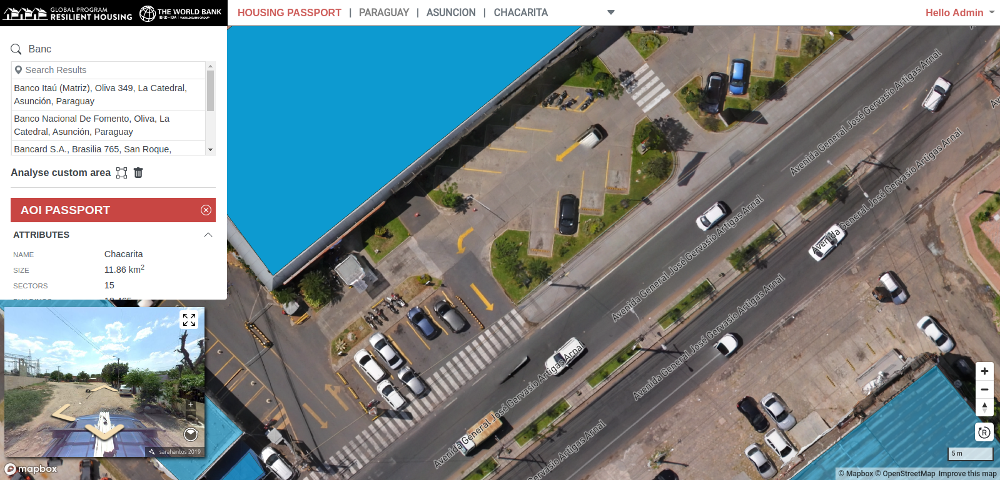
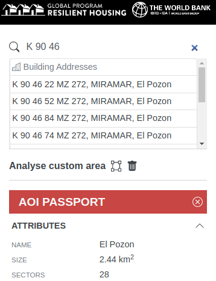
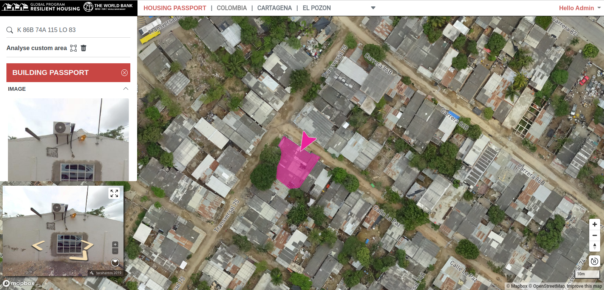

# Searching Data

The Housing Portal sidebar contains a search box which allows the user to search for places or for buildings identified by the building address (if available). Two sources are used to populate the search results. The first source uses the [Mapbox Search Service](https://docs.mapbox.com/api/search/) to search for places within the current AOI. The second source searches for addresses held in the Housing Portal database.

## Mapbox Place Search

Queries to Mapbox's Search Service are restricted to an area defined as the bounding box of the AOI polygon. Because of this, some results may fall slightly outside the AOI extent. Clicking on a result centers the map at the selected location.

## Building Address Search

Clicking on a result in the Building Address search results centers the map on the relevant building. The building is automatically selected and the Building Passport is enabled in the sidebar. The Mapillary viewer navigates to the selected buidling and all other buildings are filtered out.

To reset the search, click the **'x'** in the search input field.
